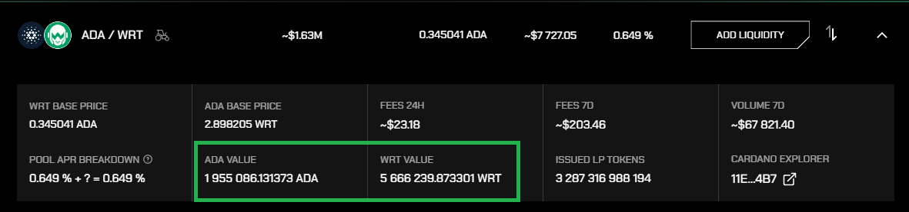
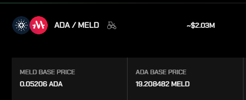

<p align="center"></p>

# `@wingriders/dex-blockfrost-adapter`

Adapter to get the WingRiders state using blockfrost. For deserialization of the data it uses [@wingriders/dex-serializer](https://github.com/WingRiders/dex-serializer) library.

## Installation

Install the package with:

```bash
npm install @wingriders/dex-blockfrost-adapter @dcspark/cardano-multiplatform-lib-nodejs
```

## Usage

A very simple use-case when using node js:

```typescript
/**
 * On WingRiders all ADA<>Token pools have different addresses.
 * Blockfrost does not support quierying just based on the script address,
 * so a mapping is necessary. There is a snapshot of the liquidity pools
 * in the test folder. Alternatively you can fetch your own running
 * $ npm run scripts:lpmap
 */
const addressMap = require("./test/lpmap.mainnet.20221013.json");

/**
 * Require or import the package. The common js package is built against
 * @dcspark/cardano-multiplatform-lib-nodejs, while the browser one againt *-browser
 */
const wr = require("@wingriders/dex-blockfrost-adapter");

/**
 * Initialize the WingRiders blockfrost adapter with your project ID
 * and the address map.
 */
const adapter = new wr.WingRidersAdapter({
  projectId: "mainnetYOUR_PROJECT_ID",
  lpAddressMap: addressMap,
  poolType: PoolType.CONSTANT_PRODUCT,
});

/**
 * The address map keys are based on the LP token assetname.
 * The ADA<>WRT lP token on mainnet is as below
 */
const adaWrtLP = addressMap["dec347c549f618e80d97682b5b4c6985256503bbb3f3955831f5679cdb8de72f"];

/**
 * Get the latest state of the liquidity pool based on the included tokens.
 * Unit - is a term from blockfrost, the concatenated `policyId <> assetName` encoded as hex
 */
console.log(await adapter.getLiquidityPoolState(adaWrtLP.unitA, adaWrtLP.unitB));

/**
 * If you are only interested in the mid ADA price based on the ADA <> MELD pool
 * the parameter is the unit similar to above. E.g. MELD asset:
 * https://cardanoscan.io/token/6ac8ef33b510ec004fe11585f7c5a9f0c07f0c23428ab4f29c1d7d104d454c44
 *
 * !Warning! The actual swap price will differ because it depends on the swapped amount
 *           and the depth of the liquidity pool.
 */
console.log(await adapter.getAdaPrice("6ac8ef33b510ec004fe11585f7c5a9f0c07f0c23428ab4f29c1d7d104d454c44"));
```

Should give you something similar to:

```js
{
  address: 'addr1z8nvjzjeydcn4atcd93aac8allvrpjn7pjr2qsweukpnaytvcg6zm2vds6mz9x3h3yalqmnf24w86m09n40q3tgqxjms9yu6v8',
  unitA: 'lovelace',
  unitB: 'c0ee29a85b13209423b10447d3c2e6a50641a15c57770e27cb9d507357696e67526964657273',
  unitLp: '026a18d04a0c642759bb3d83b12e3344894e5c1c7b2aeb1a2113a570dec347c549f618e80d97682b5b4c6985256503bbb3f3955831f5679cdb8de72f',
  issuedLpTokens: '3287316988194',
  quantityA: '1955086131373',
  quantityB: '5666239873301'
}

0.052060335367318265
```




## Examples

The `examples` folder contains additional examples how to set up bundling to interact also with frontend
applications

- **[Current Price](./examples/price-fe-vanilla-js/README.md)** - Example bundling `vite` and vanilla JS to show a token price
  on a webpage. The example intentionally does not use any frontend framework.
- **[Swap](./examples/swap-fe-vanilla-js/README.md)** - Example combining multiple aspects of interacting with WingRiders
  smart contracts: getting liquidity pool states, computing expected swap quantities, building a tx on the frontend
  using `lucid` and submitting a swap request to WingRiders.

## Known issues

- only mainnet is supported fully, proprod support is planned
- serialization lib conflicting types between nodejs and browser versions

## Development

```bash
npm install
npm run build
```
