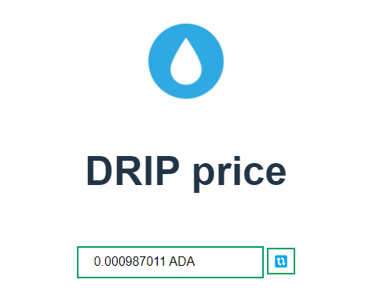

# Example - Price frontend with vanilla js

Example project using vite and vanilla js to use the dex adapter
to fetch the price of the DRIP token.

## Running locally

First copy the `.env.example` to `.env` and fill in your Blockfrost project ID. Then:

```sh
npm install
npm run dev
```

The important part of the code is in `src/price.ts`

```ts
import { PoolType, WingRidersAdapter } from "@wingriders/dex-blockfrost-adapter";
import lpAddressMap from "./selectedLpsMap.json";

const DRIP_UNIT = "af2e27f580f7f08e93190a81f72462f153026d06450924726645891b44524950";
```

The selected LP map contains only information for the DRIP token. For more tokens see `src/test/lpmap.*.json`.
The drip unit is the "subject" or "unit" that is used by blockfrost to identify tokens. It's the concatenated
policy ID and token name. It also appears in the URL when looking up the tokens on cardanoscan - [https://cardanoscan.io/token/af2e27f580f7f08e93190a81f72462f153026d06450924726645891b44524950](https://cardanoscan.io/token/af2e27f580f7f08e93190a81f72462f153026d06450924726645891b44524950).

Afterwards fetching the price is as simple as:

```ts
/* ... */
const adapter = new WingRidersAdapter({
  lpAddressMap,
  projectId: import.meta.env.VITE_BLOCKFROST_PROJECT_ID,
  poolType: PoolType.CONSTANT_PRODUCT
});

price = await adapter.getAdaPrice(DRIP_UNIT);
/* ... */
```

(`import.meta.env.VITE_BLOCKFROST_PROJECT_ID` is injected by the `vite` - the build tool during build-time)

Will give you an example UI, similar to below:


