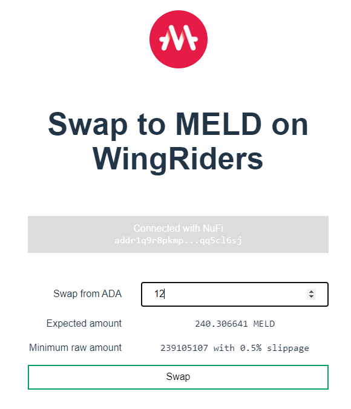

# Example - Swap with vanilla js

> WARNING! Use at your own risk!
>
> This example is provided as is. There is no guarantee about its correctness. WingRiders smart contracts
> do not allow recovery of any funds lost due to potential erronous interactions through this example.

Example project using vite and vanilla js to use the dex adapter to create a swap request on WingRiders.
The example uses the blockfrost adapter to calculate the correct prices with slippage and a deadline
set at a fixed time in the future. This example does not include handling wallet funds
(if the user has enough tokens), nor does it handle anything past creating a swap request like:

- it does not follow the request's state (if and when it gets fulfilled)
- it does not include reclaim logic
- it does not include all liquidity pools, nor swapping in the opposite direction
- it does not compute additional statistics that you would see on WingRiders details
  when creating a swap.

For all details and interactions please use the official WingRiders interface at [link](https://app.wingriders.com).

For simplicity, this example uses `lucid` to build transactions as building transactions directly with `cardano-multiplatform-lib` is much more involved and is out of scope for this example.

# Running locally

First, copy the `.env.example` to `.env` and fill in your Blockforst project ID. Then:

```sh
npm install
npm run dev
```

There are multiple pieces that work together between `dex-serializer` and `dex-blockfrost-adapter`.
The main logic is included in `src/swap.ts`.

## Connecting wallet

Before an request could be created, we need a wallet to work with. Almost all browser extension wallets support
a common interface (CIP-30 standard), which makes things easier. For simplicity we lean on `lucid` to build and sign transactions.

The basic parts for connecting a wallet are:

```ts
// ask the wallet to allow connecting this app to it
// USED_WALLET can be any of `nufi`, `nami`, `eternl`, ... etc
walletApi = await window.cardano[USED_WALLET].enable();

// ...

/**
 * Get the first used address of the wallet
 * This can be a bit unstable, but it is one of the most stable
 * ways how to get a `unique` address for an account.
 * For most HD wallets this will be the first address.
 */
owner = (await walletApi.getUsedAddresses())[0];

// This is done by lucid internally to build the transactions from
const utxos = await walletApi.getUtxos();
```

The `owner` is used to identify the wallet in the swap request. This is the address that identifies
the wallet which can reclaim the request, or where the compensation (the MELD tokens) will be sent by WingRiders.

## Exchange rate

Before creating a swap request, we also need to get the current liquidity pool state to calculate the correct
exchange ratio. To get the current pool state for the ADA <> MELD liquidity pool, the process is similar to how the
[price](../price-fe-vanilla-js/README.md) example works.

```ts
// instead of adapter.getAdaPrice(MELD_UNIT)
const state = await adapter.getPoolState("lovelace", MELD_UNIT);
// + now calculate the exchange price with the AMM formula
```

Calculating might not be the most straightforward when considering deposits, slippage and various fees.
The `adapter` exposes a helper function to compute the estimated expected amount to be received based on the last
liquidity pool state:

```ts
const { expectedAmount, expectedRawAmount, swapRawAmount } = await adapter.computeExpectedSwapAmount(
  "lovelace",
  amount,
  MELD_UNIT
);
```

Since the amount the user enters might be in the user-friendly format (e.g. 1.234567 MELD is represented actually as 1234567 tokens),
the helper function also returns the raw token amounts. These are important when building the request datum and locked amounts.

To make sure the request goes through, we can reduce the minimum expected amount by some slippage:

```ts
const expectedTokens = BigNum.from_str(expectedRawAmount);
const minimumTokens = expectedTokens.clamped_sub(
  expectedTokens.checked_mul(BigNum.from_str(SLIPPAGE_IN_BASIS)).checked_div_ceil(BigNum.from_str("10000"))
);
```

This ensures that even if there were some relatively small swaps submitted before this that would change the exchange ratio
in a way that's not beneficial to us, we would still be OK with a small price drop.
(NOTE: if the price moves in the other direction, the smart contracts still ensure that more tokens are returned to the user
based on the exchange ratio at the given point in time the swap is **fulfilled** NOT _created_.)

Where `SLIPPAGE_IN_BASIS = "50"`, which means we are OK `0.5 %` slippage off the current price.

Up to this point the UI should look like:



## Building the Swap request

With the wallet connection, wallet owner's address and exchange rate estimate we have now everything to build a swap request datum:

```ts
// in 6 hours the request will expire and the WingRiders agents have to ignore it and it can be reclaimed
const deadline = Date.now() + 6 * 60 * 60 * 1000;

const datum = new RequestDatum(
  new RequestMetadaDatum(
    ownerAddress,
    ownerAddress.payment_cred()!, // the owner whe can reclaim the request
    RBigInt.from_str(deadline.toFixed(0)), // deadline in posix time
    assetClassFromUnit("lovelace"), // the LP assets need to be ordered, always ADA first
    assetClassFromUnit(MELD_UNIT)
  ),
  new SwapAction(SwapDirection.ATOB, RBigInt.from_str(minimumTokens.to_str()))
).to_plutus_data();
```

The first part of the swap request datum is common for all requests be it swap or add/remove liquidity - `RequestMetadataDatum`.
It identifies the owner, expiration of the request and the liquidity pool.

The second part of the request is specific to swaps - `SwapAction`. It includes the direction of the swap (from ADA to MELD) or
from (MELD to ADA). The tokens in the liquidity pool are stictly ordered, with ADA always being the first. So `ATOB` means we
are swapping from ADA to MELD. If it was `BTOA` it would mean we are trying to sell MELD for ADA.

### Addresses and Values

Apart from the correct smart-contract datum, the swap also needs to contain enough tokens and ADA for the swap request.
Since we are swapping ADA for MELD, the request should contain only ADA:

```ts
// compute the number of coins to be deposited with the request
// the returned swapRawAmount is in lovelaces already
const lockedCoins = BigNum.from_str(swapRawAmount)
  .checked_add(BigNum.from_str(REQUEST_BATCHER_FEE))
  .checked_add(BigNum.from_str(REQUEST_OIL));
```

The batcher fee is there to cover the transaction fees that are done by the agents.
The `REQUEST_OIL` is the oil ADA deposited, that is returned with the swapped MELD tokens.

Finally we can build a tx with lucid that sends the funds and datums to the request smart contract.

```ts
unsignedTx = await lucid
  .newTx()
  .payToContract(
    lucid.utils.credentialToAddress(lucid.utils.scriptHashToCredential(REQUEST_SCRIPT_HASH)),
    L.toHex(datum.to_bytes()),
    {
      lovelace: BigInt(lockedCoins.to_str()),
    }
  )
  .complete();
```

## Sign and submit

All that is left is to sign and submit the transactionto the blockchain. All of this can be done through
the standard wallet interface (CIP-30), but the transactions should be already in a specific format expected
by the blockchain. To help out with serialization, we agian use `lucid`:

```ts
const signedTx = await unsignedTx.sign().complete();
const txHash = await signedTx.submit();
```

These function calls will interact with the wallet, ask the user to sign the transaction and then submit it.
The returned `txHash` can be used to look up the transaction on blockchian explorers.

# Developer notes

`lucid` and `cardano-multiplatform-lib` (or `cardano-serialization-lib`) for that matter are tricky to set up
to work properly with frontend bundlers sometimes due to webassembly parts. Take a peek at `vite.config.js`

```js
{
  // ...
  plugins: [wasm(), topLevelAwait()],
  // ...
}
```

allows `cardano-multiplatform-lib-browser` to be loaded correctly. `lucid` due to its dependencies and setup is a bit more
tricky. As a shortcut for modern browsers one can use with vite:

```js
{
  // ...
  resolve: {
    alias: [
      // workaround for lucid as bundling it is messy
      { find: "lucid-cardano", replacement: "https://unpkg.com/lucid-cardano@0.7.6/web/mod.js" },
    ],
  },
  // ...
}
```

Which replaces all imports for `lucid` with a dynamic import for the hosted version of the module.
This way lucid is not bundled together with the application, but only modern browsers are suppoted.
